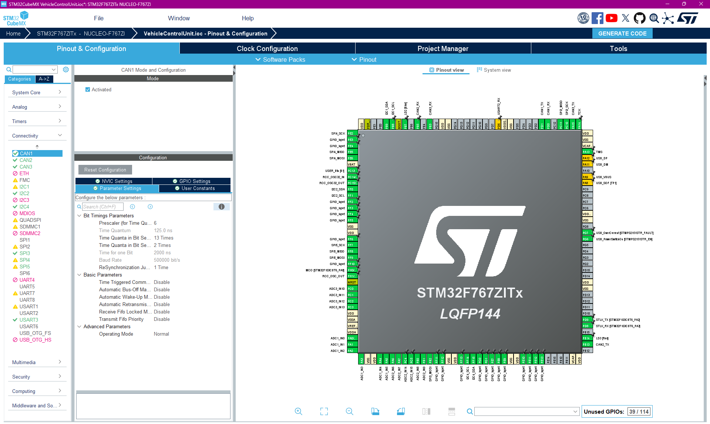

# Vehicle Contorl Unit 🏎️
(Don't worry, our code is better than our spelling! 🙂 )
## Overview
This is a custom implementation of a Vehicle Processor written by Rensselaer Motorsport to be used on FSAE vehicles through the STM32F767Zi microprocessor. It implements several systems and safety features to provide a secure and reliable method of operating datalogging, controls, and component simulation operations on a vehicle.

While our implementation is configured to be a central car computer and controller, this same code can be used to make something like a local CAN node or a small datalogging unit on a less powerful STM chip (i.e. F1 or F3) by reconfiguring code through STM32 Cube MX.

This software is intended to be run on a real time operating system (i.e. FreeRTOS).

### Documentation:
For code documentation, please see our Doxygen page: [RM-VCU Doxygen](https://rensselaermotorsport.github.io/VehicleControlUnit/files.html)

### General Program Structure
The VCU architecture is backboned by a scheculer containing updateable tasks. The Updateable type is the root for everything, and ensures functionality for enabling, disabling, updating, and safety checking any component that is an updateable. Three main components branch off of the updateable class: sensors, systems, and outputs. Sensors and outputs are self explanatory, having analog and digital counterparts for both. Systems contain four components:

- Communications: These represent interfaces for complex communication protocols like CAN Bus, I2C, etc. Controllers and External systems can interact with communicatinos systems to send and recieve data about the car.
- Controllers: These are control systems for various components on the car. They can interact with sensors and outputs, along with other controllers or external systems to recieve and post data. However, before posting data to other systems or outputs, they must first be verified by monitor systems.
- External: These represent shells of external components such as Inverters, BMS', etc. These can be used for storing variables in datalogging, and to simulate external systems if need be. 
- Monitors: These are the safety component to Controller systems. It includes a set of routine tests that execute at the end of a Controller's update period. When all of a Controller's Monitors have passed, the Controller is moved from a computed to validated state, ensuring that it can safelt post to external resources, or respond to requests for data.

### Folder Structure
```
VehicleControlUnit/
├── Core/
│   ├── Inc/                  # Header files
│   │   └──                    # Similar to Src/
│   ├── Src/                  # Source files
│   │   ├── Outputs/          # Digital and Analog Outputs
│   │   ├── Scheduler/        # Scheduling service for VCU
│   │   ├── Sensors/          # Digital and Analog Inputs
│   │   ├── Systems/          # Control, Safety, & Comm Systems
│   │   └── Utils/            # Helper files
│   ├── Tests/                # Unit tests
│   └── Makefile              # makefile
├── Hardware/                 # KiCAD files for hardware dev
├── Documentation/            # Project documentation resources
├── Drivers/                  # Hardware abstraction layer drivers
│   ├── CMSIS/                # CMSIS files
│   └── STM32F7xx_HAL_Driver/ # STM32 HAL drivers
├── .gitignore                # Git ignore file
├── README.md                 # Project readme
└── VehicleControlUnit.ioc    # Cube MX configuration file
```

## Software Compilation on VS Code

### Basic Setup for Software Compilation
To compile purely software using cmake

1. You idealy would want to fetch the repository to the same directory that can be accessed by STM32 Cube IDE to ensure seamless workflow and updates from software to hardware, so follow step 1 to 4 from [Basic Setup for Hardware Compilation](#basic-setup-for-hardware-compilation)
2. Open the repository folder in VS Code. 
3. Install the [Cortex-Debug](https://marketplace.visualstudio.com/items?itemName=marus25.cortex-debug), [C/C++](https://marketplace.visualstudio.com/items?itemName=ms-vscode.cpptools) and [WSL](https://marketplace.visualstudio.com/items?itemName=ms-vscode-remote.remote-wsl) extensions in VS Code. 
4. Install WSL from Microsoft Store.
5. Open WSL in terminal.
6. Install the required tools in WSL using the following commands:
    ```
    sudo apt update
    sudo apt install -y gcc-arm-none-eabi
    sudo apt install -y build-essential cmake
    sudo apt install -y ninja-build
    sudo apt install make cmake
    ```
7. cd to the repository using WSL:
    ```
    cd /mnt/c/Users/yourusername/STM32CubeIDE/workspace_x.xx.x/VehicleControlUnit
    ```
8. Open repository with WSL in VS Code:
    ```
    code .
    ```
9. cd to the directory that houses the makefile:
    ```
    cd Core
    ```
10. Build the project using cmake
    ```
    make clean 
    make all
    make test?
    ```
11. TO DO: Write what to expect

### SIL (Software-In-Loop) Testing

 1. Install WSL from Microsoft Store
 2. Run terminal as administrator
 3. run `wsl --update` (If it's stuck at 0%, try `wsl --update --web-download`)
 4. Start wsl in terminal: `wsl`
 5. `sudo apt-get update && sudo apt-get upgrade -y`
 6. `sudo apt-get install gcc -y`
 7. git clone VCU repo in wsl
 8. Open in VScode `code .`
 9. Change directory to Core `cd Core`
 10. Define the environment variable `TEST_MODE` (e.g. `export TEST_MODE=1`)
 11. Open terminal and run: `make "test file directory".out && ./"test file directory".out` (e.g. `make Tests/TorqueControlActuatorTest.out && ./Tests/TorqueControlActuatorTest.out`)

#### SIL Testing on Linux

1. Update and install dependencies: (e.g. `sudo apt-get update && sudo apt-get upgrade && sudo apt-get install gcc -y`)
2. Clone repo into your working directory (`git clone https://github.com/RensselaerMotorsport/VehicleControlUnit.git`)
3. Change directory to `Core` (`cd VehicleControlUnit/Core`)
4. Define the environment variable `TEST_MODE` (`export TEST_MODE=1`)
5. Build the desired test with `make` (e.g. `make Tests/Utils/LUT.out`)
6. Run the test and examine output (e.g. `./Tests/Utils/LUT.out`)

## Software Compilation to Hardware (STM 32 Cube IDE)

### Basic Setup for Hardware Compilation

To compile software into firmware that is flashed onto the STM32 board. 

1. Install [STM32 Cube IDE](https://www.st.com/en/development-tools/stm32cubeide.html#:~:text=Read%20more-,Get%20Software,-Part%20Number) 
2. Upon intsallation, find the STM32CubeIDE directory. It should be at `C:\Users\yourusername\STM32CubeIDE` if the default installation instructions are followed
3. Depending on the installed version, a folder titled `workspace_x.xx.x` should be found
4. Fetch the entire repository into the folder. Go to your native terminal, then enter the command:
    ```
    git clone https://github.com/RensselaerMotorsport/VehicleControlUnit C:\Users\yourusername\STM32CubeIDE
    ```
5. A folder titled VehicleControlUnit should appear in your workspace. 
6. Open STM32 Cube IDE. Select `C:\Users\yourusername\STM32CubeIDE\workspace_x.xx.x` as the launch directory.
7. Connect STM32 board to computer. Flash firmware by running the project in debug mode. Refer to [HIL](#hil-hardware-testing) and [PIL](#pil-processor-testing) testing sections for more details

### Developing Tips on the IDE
#### File Creation / Duplication
- New project with **existing .ioc file**:

    File > New > STM32 Project from an Existing STM32CubeMX Configuration File (.ioc), then select the pre-existing file

- New project with unintialized .ioc file: 

    File > New > STM32 Project, then enter board name into "Commercial Part Number"

#### Code generation with .ioc file 

HAL intialization code for peripherals can be automatically generated into main.c once configured in the .ioc file. Any changes in the .ioc file will require code generation (to update main.c) - right click the .ioc file then click "Code Generation". 


> [!CAUTION]
> Code generation rewrites files such as main.c/.h, stm32*.c/.h, and so. Make sure any custom code is inbetween the comments labelled "BEGIN/END USER CODE." Otherwise, it will overwrite any code you wrote outside these blocks. Anything inside of the Scheduler, Sensors, System, Outputs, and Utils folders is safe.
#### Useful STM32 Documentation

This first section come's from [RPI's ECSE 4790 homepage](https://sites.ecse.rpi.edu/courses/static/ECSE-4790/resources.html), and is copied word for word:
- [Datasheet](https://sites.ecse.rpi.edu/courses/static/ECSE-4790/_downloads/7f7327136f5c83e037dd8bf9120ce65b/stm32f769xx_Datasheet.pdf): Contains specifications, pinouts, electrical characteristics and limitations, etc. of STM32F7xx Chips
- [Errata (ES0334)](https://sites.ecse.rpi.edu/courses/static/ECSE-4790/_downloads/59aca466492bfb25073b6375ef6a94b3/ES0334_stm32f76xxx_Errata.pdf): A list of known bugs and workarounds.
- [Reference Manual (RM0410)](https://sites.ecse.rpi.edu/courses/static/ECSE-4790/_downloads/6741063f8f7385e79b0fa1130b398c72/RM0410-stm32f76xxx_Reference_Manual.pdf): Contains overview and functionality of each component of the device in addition to each component’s applicable registers.
- [Programming Manual (PM0253)](https://sites.ecse.rpi.edu/courses/static/ECSE-4790/_downloads/4e8bb486014bd0f7218a6c050ca04728/PM0253-stm32f7_Programming_Manual.pdf): Describes low-level programming models for the device, memory/address mapping, and instruction sets (assembly).
- [HAL and LL Driver Manual (UM1905)](https://sites.ecse.rpi.edu/courses/static/ECSE-4790/_downloads/9d0bbd399996d3a12e1ccbd9c7b3dfa5/UM1905-stm32f7_HAL_and_LL_Drivers.pdf): Description of the Hardware Abstraction Layer (HAL) and Low-Layer (LL) drivers and their contained functions, structs, constants, etc.
- [ADC Modes Overview (AN3116)](https://sites.ecse.rpi.edu/courses/static/ECSE-4790/_downloads/13a0f873aa3b4acb44116670b5d7434e/AN3116-stm32_ADC_modes.pdf): Brief overview of the Analog-to-Digital Converters for STM32 devices. This includes indepdent, interleaved, trigger, injected etc. modes in single and multi-channel.
- [DSP Overview (AN4841)](https://sites.ecse.rpi.edu/courses/static/ECSE-4790/_downloads/93ea37dd0b9319c4663bb1f6fb5cf686/AN4841-stm32_DSP_using_CMSIS.pdf): Brief overview of Digital Signal Processing support on STM devices, including discussions of hardware DSP commands and supporting drivers.
- [DMA Controller Overview (AN4031)](https://sites.ecse.rpi.edu/courses/static/ECSE-4790/_downloads/3ae2bb168327c58be3daa8fedeb1a428/AN4031-stm32_DMA_Controller.pdf): Thorough overview of the Direct Memory Access Controllers for STM32 devices.
- [USB Host Library Manual (UM1720)](https://sites.ecse.rpi.edu/courses/static/ECSE-4790/_downloads/45ce42dd98c03962db568619aa479ee5/UM1720-stm32_USB_Host_Library.pdf): Description of the abstraction library for configuring STM32 devices to be a USB Host Controller.
- [USB Device Library Manual (UM1734)](https://sites.ecse.rpi.edu/courses/static/ECSE-4790/_downloads/c5c44d90d897e5752d66a41ac6125157/UM1734-stm32_USB_Device_Library.pdf): Description of the abstraction library for configuring STM32 devices to be a USB peripheral.
- [FatFs Filesystem Manual (UM1721)](https://sites.ecse.rpi.edu/courses/static/ECSE-4790/_downloads/5eb7dc73663cc9f9bbcbc34d9ef0dd3f/UM1721-stm32_FatFs_Library.pdf): Overview of the FatFs library for interfacing with FAT filesystems. The source project documentation can be found here: http://elm-chan.org/fsw/ff/00index_e.html.

This second section comes from resources team members have found independently:
- [Nucleo Board Documentation (MB1137)](https://www.st.com/resource/en/user_manual/um1974-stm32-nucleo144-boards-mb1137-stmicroelectronics.pdf): Overview of available hardware on the Nucleo Board and GPIO pinouts. Make sure to reference sections for F767Zi.
- [Timers](https://wiki.st.com/stm32mcu/index.php?title=Getting_started_with_TIM&oldid=58943#STM32CubeMX_Timer_configuration): Basic intro on how to configure and use timers on STM32 devices.
- [Digital to Aanalog Converters](https://wiki.st.com/stm32mcu/wiki/Getting_started_with_DAC): Basic intro on how to configure and use DACs on STM32 devices.
- [Analog to Digital Converters](https://www.bing.com/search?q=stm32+adc+&qs=n&form=QBRE&sp=-1&ghc=1&lq=0&pq=stm32+adc+&sc=12-10&sk=&cvid=12323BBFA4DF4267B9A0CDEB00B38924&ghsh=0&ghacc=0&ghpl=): Basic intro on how to configure and use ADCs on STM32 devices.
- [Controller Area Network (CAN)](https://controllerstech.com/can-protocol-in-stm32/): Basic intro on how to configure and use CAN on STM32 devices.
- [Real Time Operating System (RTOS)](https://embeddedthere.com/getting-started-with-freertos-in-stm32-example-code-included/): Basic intro on how to configure and use RTOS on STM32 devices.
- [Real Time Operating System (RTOS) Playlist](https://www.youtube.com/playlist?list=PLnMKNibPkDnExrAsDpjjF1PsvtoAIBquX): Much more in depth overview of RTOS

### HIL (Hardware-In-Loop) Testing
It may be useful to first setup a test bench to simulate your car's hardware. The bench below simulates the following:

- CAN Bus activity on Bus 1
- APPs input (double)
- Brake input
- RTD input
- Throttle Signal output
- Brake Light output
- RTD status indicator


After constructing your test bench, you can directly modify the main.c file with firmware for testing the desired systems. You can also set up a separate file in the Tests folder where you import the main function of the system you want to test. Follow these steps for proper testing procedures:

1. **Modify main.c** (Option 1):
    - Ensure that your test bench is properly connected and powered.
    - Open the main.c file in your project.
    - Insert the necessary test code within the `BEGIN/END USER CODE` blocks to avoid overwriting during code generation.
    - Compile and flash the firmware onto the STM32 board.

2. **Create a Test File** (Option 2):
    - Navigate to the Tests folder in your project directory.
    - Create a new test file, e.g., `SystemTest.c`.
    - Include the necessary headers and import the main function or specific functions you want to test.
    - Write test cases to validate the functionality of the system.
    - Reference these tests in main.c, compile and flash the firmware onto the STM32 board.

3. **Run Tests**:
    - Monitor the output of the tests to ensure that the system behaves as expected.
    - Use debugging tools in STM32 Cube IDE or VS Code to step through the code and inspect variables and memory.

4. **Document Results**:
    - Record the results of your tests, noting any discrepancies or issues.
    - Update the documentation with any changes or findings from the tests.

By following these procedures, you can ensure that your firmware is thoroughly tested and reliable before deployment.

### PIL (Processor-In-Loop) Testing 
Still bringing this up, but ideally you will be able to run software on the microprocessor itself, but without need for hardware aside from the board. This lets you test within the microprocessor to make sure you are not running into computation limits, memory limits, or separation from real-time, but provides more mobile-friendly testing in opposition to carrying a HIL testbench around.


## Useful Git Commands and Tools

### Command Line Git
#### git clean -xfd

Removes all untracked files and directories from your working directory.Essentially, prevents files like build artifacts, generated binary files, IDE-specific temporary files and debug outputs from getting commited.

- x: Removes ignored files
- f: Forces the clean operation
- d: Removes untracked directories

TO DO: Add more useful cli commands

### Tools
#### VS Code Source Control

Intuitive and accessible GUI for committng, creating pull requests, creating branches... essentially replaces the need to use command line git. 

#### [Github Pull Request Extension](https://marketplace.visualstudio.com/items?itemName=GitHub.vscode-pull-request-github)

Allows reviewing and managing of GitHub pull requests and issues directly in VS Code.

#### [Github Desktop](https://desktop.github.com/download/)

Intuitive GUI for cloning repositories to user specified directories, switching branches, fetching/pushing from origin.

#### Pretty Graphs
Run this command in the terminal to generate pretty git commit graphs
```git log --graph --abbrev-commit --decorate --date=relative --all```

#### STM32 Cube IDE
Useful for compiling code onto STM boards, and to also debug in real time on the hardware. You can put in breakpoints, view memory regions, and CPU utilization to name some useful tools.

#### STM32 Cube MX
Useful for configuring clocks and GPIO on STM boards using HAL (Hardware Abstraction Layer). It can then generate this code into the project for you.

</br>

> [!CAUTION]
> Code generation rewrites files such as main.c/.h, stm32*.c/.h, and so. Make sure any custom code is inbetween the comments labelled "BEGIN/END USER CODE." Otherwise, it will overwrite any code you wrote outside these blocks. Anything inside of the Scheduler, Sensors, System, Outputs, and Utils folders is safe.

</br>
STM 32 Cube MX interface for GPIO:



</br>
STM 32 Cube MX interface for Clocks:


